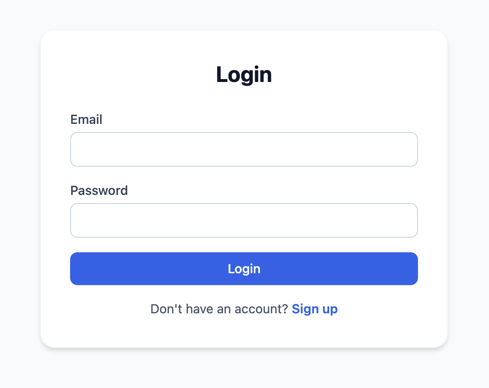
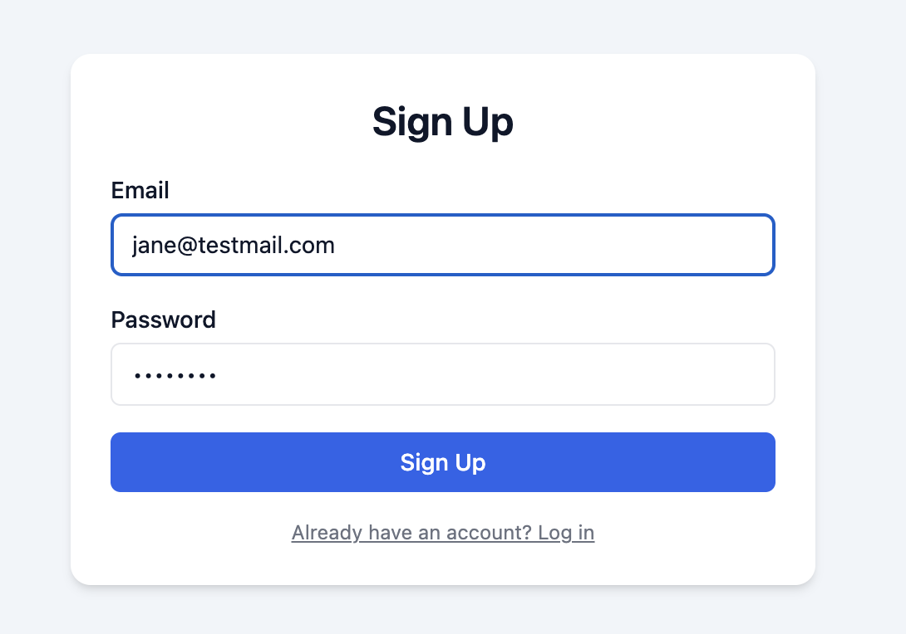

# Contact Management Application

This project is a full-stack Contact Management Application. It includes full CRUD functionality, secure authentication, role-based authorization, file uploads, search, sorting, pagination, and a responsive frontend UI.

---

## Features Overview

### Backend (Nest.js + PostgreSQL)
A secure REST API with:
- User registration and login (POST /auth/register, POST /auth/login)
- JWT-based authentication
- Role-based access control (user, admin)
- Protected routes using custom JWT and Roles guards
- Contact CRUD operations:
  - POST /contacts – Create a contact (name, email, phone, photo)
  - GET /contacts – List contacts with pagination, search, sorting
  - GET /contacts/:id – Get a contact (ownership enforced)
  - PATCH /contacts/:id – Update a contact
  - DELETE /contacts/:id – Delete a contact
- Photo upload support stored in /uploads/contacts
- Advanced validation using class-validator
- Global exception handling and standardized error responses

---

## Frontend (Next.js)
A responsive and interactive UI featuring:
- Login and registration pages
- JWT-based session persistence
- Contacts list page with:
  - Pagination
  - Search (name/email)
  - Sorting (name / createdAt)
  - Inline editing
  - Delete confirmation
  - Photo upload with preview
- Admin mode (?all=true) to view all contacts
- Custom styling similar to Tailwind
- Clean and modern layout

---

## Project Structure

contact-management-app/
 backend/   (Nest.js API)
 frontend/  (Next.js Client)

---

## Backend Setup

1. Navigate to the backend folder:
   cd backend

2. Install dependencies:
   npm install

3. Create a .env file in the backend folder with the following values:
   DB_HOST=localhost
   DB_PORT=5432
   DB_USERNAME=postgres
   DB_PASSWORD=YOUR_PASSWORD
   DB_DATABASE=contacts_db
   JWT_SECRET=your_secret_key
   JWT_EXPIRES_IN=1d

4. Start the backend server:
   npm run start:dev

The backend runs at:
http://localhost:3000

---

## Frontend Setup

1. Navigate to the frontend folder:
   cd frontend

2. Install dependencies:
   npm install

3. Start the development server:
   npm run dev

The frontend runs at:
http://localhost:3001

---

## API Summary

### Authentication Endpoints
POST /auth/register – Register new user  
POST /auth/login – Login and receive JWT token  
GET /auth/me – Get current user info  

### Contact Endpoints
POST /contacts – Create a contact (supports photo upload)  
GET /contacts – Get paginated contacts with search & sorting  
GET /contacts/:id – Get a single contact (ownership enforced)  
PATCH /contacts/:id – Update a contact  
DELETE /contacts/:id – Delete a contact  

### Query Example
GET /contacts?page=1&limit=10&search=john&sortBy=name&sortOrder=ASC

### Admin Mode
Admins can view all contacts:
GET /contacts?all=true

---
## Screenshots

### Login Page

   
  Login Form

   
  Contact List

단점
---

## Tech Stack

### Backend
Nest.js  
PostgreSQL  
TypeORM  
JWT Authentication  
Multer  
class-validator / class-transformer  

### Frontend
Next.js (App Router)  
Axios  
React Hooks  
Custom tailwind-like styling  

---

## Running the Full Project

1. Ensure PostgreSQL is running and a database named contacts_db exists.
2. Start the backend:
   cd backend
   npm run start:dev
3. Start the frontend:
   cd frontend
   npm run dev
4. Open the browser at:
   http://localhost:3001/login

---

## Notes

- This project uses TypeORM synchronize: true to simplify setup.
- Migrations were excluded intentionally for simplicity.

---

## Conclusion

This project demonstrates full-stack development skills across backend API architecture, authentication, authorization, database integration, file upload handling, and a responsive Next.js frontend. It showcases clean architecture, maintainable structure, and production-ready user experience.
